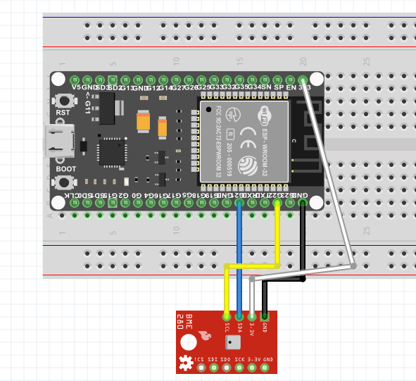
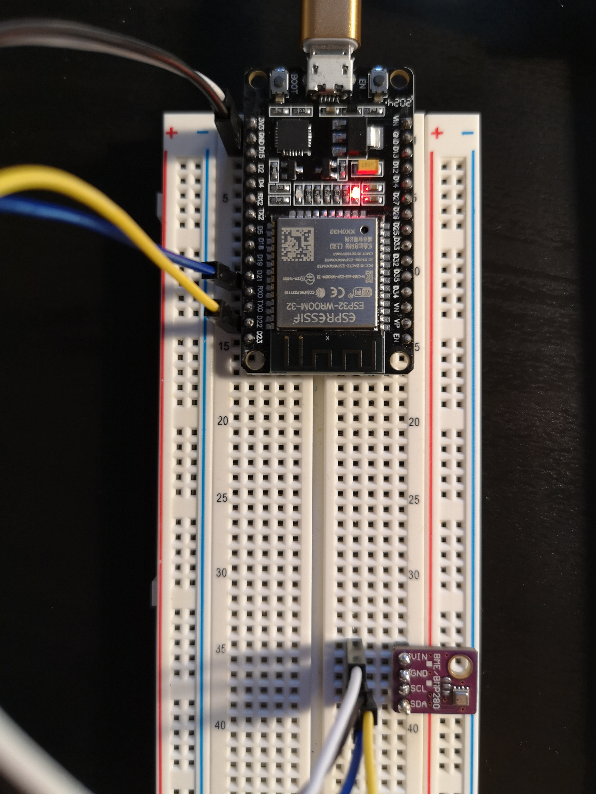
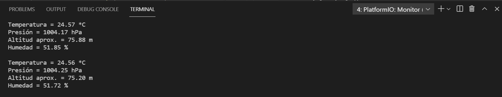

# Práctica 5.2 Buses de comunicación I (introducción a I2C)
###### Andrea Muñiz
<p></p>

## Programa + explicación

> Declaramos las librerias necesarias

```
#include <Wire.h>
#include <Adafruit_Sensor.h>
#include <Adafruit_BME280.h>
```

> Definimos las variables que necesitaremos

- __I2C_SDA__: Pin de nuestra placa en el que se encuentra la salida SDA. En este caso el pin 21.
- __I2C_SCL__: Pin de nuestra placa en el que se encuentra la salida SCL. En este caso el pin 22.
- __SEALEVELPRESSURE_HPA__: Presion a nivel del mar para tener de referencia a la hora de medir la presión a la que estamos.

```
#define I2C_SDA 21
#define I2C_SCL 22
#define SEALEVELPRESSURE_HPA (1013.25)
```

> Creamos el bus que utilizaremos para mandar y recibir la información.

```
TwoWire I2CBME = TwoWire(0);
```

> Creamos una variable tipo _Adafruit_BME280_.

```
Adafruit_BME280 bme;
```

> Creamos una variable larga donde podemos guardar los datos de temperatura, presión, humedad y altitud.

```
unsigned long delayTime;
```

> Función setup()

En esta función inicializamos el serial a una velocidad de 115200 y escribimos en el monitor serie "BME280 test". A continuación iniciamos la comunicación I2C con tres variables, los dos pines SDA y SCL creados antes y la frecuencia deseada.
A continuación creamos un boleano que nos ayudará a saber si se ha podido encontrar el sensor o no. En caso de no encontrarse, se escribirá por pantalla _No se ha encontrado un sensor BME280 válido_

```
void setup() {
    Serial.begin(115200);
    Serial.println(F("BME280 test"));
    I2CBME.begin(I2C_SDA, I2C_SCL, 100000);

    bool status;
    status = bme.begin(0x76, &I2CBME);  
    if (!status) {
        Serial.println(" No se ha encontrado un sensor BME280 válido.");
        while (1);
  }

    Serial.println("-- Default Test --");
    delayTime = 1000;

    Serial.println();
}
```

> Función printValues()

Esta función imprime por el monitor serie los datos de temperatura, presión, altitud aprox. y Humedad con sus unidades correspondientes. Para ello se utilizan las funciones __readTemperature()__, __readPressure()__, __readAltitude()__ y __readHumidity()__.

```
void printValues() {
    // Temperatura
    Serial.print("Temperatura = ");
    Serial.print(bme.readTemperature());
    Serial.println(" *C");
    
    // Presión
    Serial.print("Presión = ");
    Serial.print(bme.readPressure() / 100.0F);
    Serial.println(" hPa");

    // Altitud aproximada
    Serial.print("Altitud aprox. = ");
    Serial.print(bme.readAltitude(SEALEVELPRESSURE_HPA));
    Serial.println(" m");

    // Humedad
    Serial.print("Humedad = ");
    Serial.print(bme.readHumidity());
    Serial.println(" %");

    Serial.println();
}
```

> Función bucle

Esta función genera un bucle el cual llama a la función __printValues()__ para que imprima los datos y después espera un tiempo que ya hemos declarado con anterioridad, un segundo.

```
void loop() { 
    printValues();
    delay(delayTime);
}
```

***

## Montaje

A continuación se adjunta una imagen de las conexiones realizadas.




***

## Salida de la impresión serie

