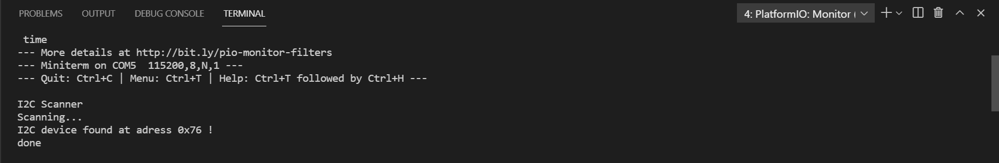

# Práctica 5.1 Buses de comunicación I (introducción e I2C)
###### Andrea Muñiz
<p></p>

## Programa + explicación

> Declaramos las librerías necesarias

```
#include <Arduino.h>
#include <Wire.h>
```

> Función setup()

En esta función inicializamos el serial a una velocidad de 115200 y creamos un bucle _while_ en el cual mientras se inicia el serial, escribe por pantalla _I2C Scanner_.

```
void setup(){
    Wire.begin();
    Serial.begin(115200);
    while (!Serial);
    Serial.println("\nI2C Scanner");
}
```

> Función bucle

En esta función se realiza un escaneo de los dispositivos conectados al microcontrolador ESP32. Se añade un bucle for en el cual se generan los errores, si el "error" es 0, se escribe por pantalla _I2C device found at adress 0x--_. En este "error" se informa de que se ha encontrado un dispositivo con dirección hexadecimal 0x--, siendo -- el número correspondiente al dispositivo. Si el error es el 4, se informa de que hay un error desconocido en el dispositivo conectado. Además al final de cada una de las opciones se le resta uno a la variable que contiene el numero de dispositivos que se han detectado conectados, de forma que se pasa al siguiente. Por último, cuando el número de dispositivos es 0, se informa por el monitor serie de que no se han encontrado dispositivos conectados a la placa ESP32 y que por lo tanto el escaneo ha finalizado.

```
void loop(){
    byte error, adress;
    int nDevices;
    Serial.println("Scanning...");
    nDevices = 0;
    for(adress = 1; adress < 127; adress++){
        Wire.beginTransmission(adress);
        error = Wire.endTransmission();
        if(error == 0){
            Serial.print("I2C device found at adress 0x");
            if (adress < 16)
            Serial.print("0");
            Serial.print(adress, HEX);
            Serial.println(" !");
            nDevices++;
        }
        else if (error == 4){
            Serial.print("Unknown error at adress 0x");
            if (adress < 16)
            Serial.print("0");
            Serial.println(adress, HEX);
        }
    }
    if (nDevices == 0)
    Serial.println("No I2C devices found\n");
    elseSerial.println("done\n");
    delay(5000);
}
```

***

## Salida de la impresión serie

Como resultado de cargar este programa, si abrimos el monitor serie observaremos las siguientes lineas:

```
I2C Scanner
Scanning...
I2C device found at adress 0x--
done
```

Siendo _0x--_ el número de dirección del dispositivo conectado en hexadecimal.

A continuación una captura de los mensajes del monitor serie obtenidos en mi caso. Para ello se ha utilizado un sensor BME280, medidor de temperatura, humedad y presión atmosférica.

